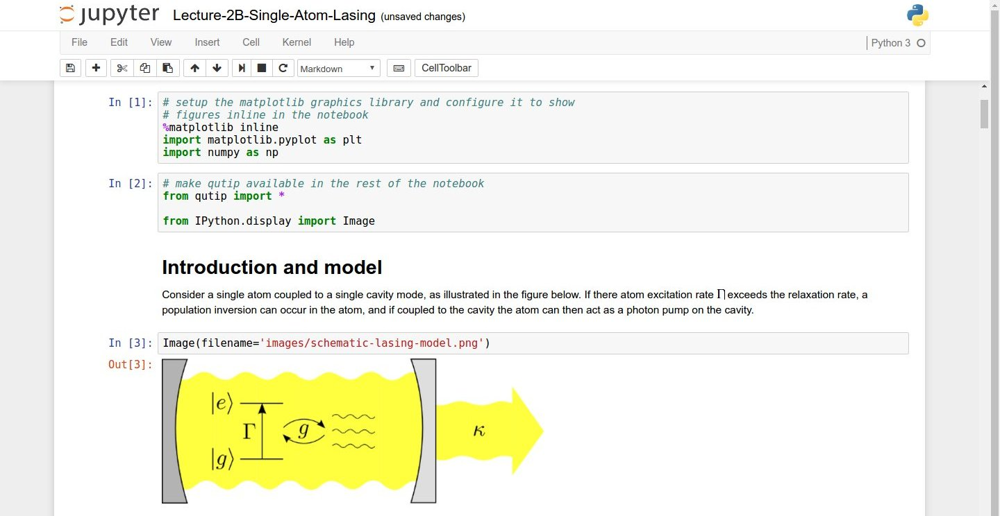

> ## Getting the Data
>
> The data we will be using is taken from the [gapminder](https://gapminder.org) dataset.
> Create a directory called `python-novice-gapminder`, and download the zip file
> [python-novice-gapminder-data.zip]({{page.root}}/files/python-novice-gapminder-data.zip)
> into it.  Then unzip the file (it should create a `data` folder.  Then start a Jupyter 
> notebook from inside this directory (see the second header below).  
> {: .challenge}

## Python programs are plain text files.

*   They have the `.py` extension to let everyone (including the operating system) 
    know it is a Python program.
    *   This is convention, not a requirement.
*   It's common to write them using a text editor but we are going to use
    the [Jupyter Notebook][jupyter].
*   The bit of extra setup is well worth it because the Notebook provides code completion 
    and other helpful features.
*   Notebook files have the extension `.ipynb` to distinguish them from plain-text Python programs.
    *   Can export as "pure Python" to run from the command line.

## Use the Jupyter Notebook for editing and running Python.

*   The [Anaconda package manager][anaconda] is an automated way to install the Jupyter notebook.
    *   See [the setup instructions]({{ page.root }}/setup/) for Anaconda installation instructions.
*   It also installs all the extra libraries it needs to run.
*   Once you have installed Python and the Jupyter Notebook requirements, open a shell and type:

    ~~~
    $ jupyter notebook
    ~~~
    {: .python}

*   This will start a Jupyter Notebook server and open your default web browser. 
*   The server runs locally on your machine only and does not use an internet connection.
*   The server sends messages to your browser.
*   The server does the work and the web browser renders the notebook.
*   You can type code into the browser and see the result when the web page talks to the server.
*   This has several advantages:
    *   You can easily type, edit, and copy and paste blocks of code.
    *   Tab complete allows you to easily access the names of things you are using
        and learn more about them.
    *   It allows you to annotate your code with links, different sized text, bullets, etc.
        to make it more accessible to you and your collaborators.
    *   It allows you to display figures next to the code that produces them
        to tell a complete story of the analysis.

  
*Screenshot of a [Jupyter Notebook on quantum mechanics](https://github.com/jrjohansson/qutip-lectures) by Robert Johansson*

> ## How It's Stored
>
> *   The notebook file is stored in a format called JSON.
> *   Just like a webpage, what's saved looks different from what you see in your browser.
> *   But this format allows Jupyter to mix software (in several languages) with documentation 
      and graphics, all in one file.
{: .callout}

## Use the keyboard and mouse to select and edit cells.

*   Pressing the "return" key turns the border green and engages edit mode,
    which allows you to type within the cell.
*   Because we want to be able to write many lines of code in a single cell,
    pressing the "return" key when in edit mode (green) moves the cursor to the next line in the cell just like in a text editor.
*   We need some other way to tell the Notebook we want to run what's in the cell.
*   Pressing the "shift" and the "enter" key together will execute the contents of the cell.
*   Notice that the "return" and "shift" keys on the 
    right of the keyboard are right next to each other.

## Use comments to add documentation to programs.

~~~
# This sentence isn't executed by Python.
adjustment = 0.5   # Neither is this - anything after '#' is ignored.
~~~
{: .python}

> ## More Math
>
> What is displayed when a Python cell in a notebook
> that contains several calculations is executed?
> For example, what happens when this cell is executed?
>
> ~~~
> 7 * 3
> 2 + 1
> ~~~
> {: .python}
> 
> > ## Solution
> >
> > Python returns the output of the last calculation.
> > ~~~
> > 3
> > ~~~
> > {: .python}
> {: .solution}
{: .challenge}

[anaconda]: https://docs.continuum.io/anaconda/install
[jupyter]: http://jupyter.org/
[markdown]: https://en.wikipedia.org/wiki/Markdown
